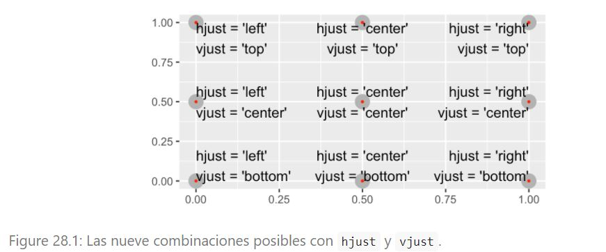

```{r setup, include= FALSE}

library(tidyverse)
library(datos)
library(ggrepel)
library(viridis)
```

para más información https://ggplot2.tidyverse.org/reference/  

## Etiquetas 

labs() es una de las funciones que podemos utilizar para agregar etiquetas
```{r labs_titulo_subtitulo_caption}
ggplot(millas, aes(cilindrada, autopista)) +
  geom_point(aes(color = clase)) +
  geom_smooth(se = FALSE) +
  labs(
    title = "La eficiencia del combustible generalmente disminuye con el tamaño del motor",
    subtitle = "Los automóviles deportivos de dos asientos son la excepción debido a su peso liviano",
    caption = "Datos de fueleconomy.gov"
  )
```
También se puede usar labs() para cambiar nombre de ejes, y de los cuadros por ejemplo de color.

```{r labs_ejes_cuadros}
ggplot(millas, aes(cilindrada, autopista)) +
  geom_point(aes(colour = clase)) +
  geom_smooth(se = FALSE) +
  labs(
    x = "Tamaño del motor (litros)",
    y = "Economía de combustible de carretera (millas)",
    colour = "Tipo de automóvil"
  )
```
En los ejes también se pueden escribir fórmulas con quote(): Más acerca de opciones disponibles en  ?plotmath
```{r quote}
df <- tibble(
  x = runif(10),
  y = runif(10)
)

ggplot(df, aes(x, y)) +
  geom_point() +
  labs(
    x = quote(sum(x[i]^2, i == 1, n)),
    y = quote(alpha + beta + frac(delta, theta))
  )
```

## Anotaciones
Para etiquetar partes principales del gráfico, grupos de observaciones u observaciones individuales. * geom_text(): es similar a geom_point() pero agrega label. Ojo que se pueden superponer...
* geom_label(): arma un recuadro alrededor del texto. También se puede superponer (con opción nudge_y se mueve el label un poco por encima)
* paquete ggrepel: ajusta automáticamente las etiquetas para que no se superpongan.

```{r geom_text geom_label geom_label_repel}
mejor_de_su_clase <- millas %>%   
  group_by(clase) %>%
  filter(row_number(desc(autopista)) == 1)

ggplot(millas, aes(cilindrada, autopista)) +    #geom_text   
  geom_point(aes(colour = clase)) +
  geom_text(aes(label = modelo), data = mejor_de_su_clase)

ggplot(millas, aes(cilindrada, autopista)) +    #geom_label
  geom_point(aes(colour = clase)) +
  geom_label(aes(label = modelo), data = mejor_de_su_clase, nudge_y = 2, alpha = 0.5)

ggplot(millas, aes(cilindrada, autopista)) +    #ggrepel::geom_label_repel
  geom_point(aes(colour = clase)) +
  geom_point(size = 3, shape = 1, data = mejor_de_su_clase) +
  ggrepel::geom_label_repel(aes(label = modelo), data = mejor_de_su_clase)

# técnica muy práctica utilizada aquí: agregar  segunda capa de puntos grandes y huecos para resaltar los puntos etiquetados.
```
También se puede utilizar esta técnica para eliminar la leyenda del cuadro, y que los textos esten en el mismo gráfico. 

```{r geom_label_repel y legend.position none}
clase_promedio <- millas %>%
  group_by(clase) %>%
  summarise(
    cilindrada = median(cilindrada),
    autopista = median(autopista)
  )

ggplot(millas, aes(cilindrada, autopista, colour = clase)) +
  ggrepel::geom_label_repel(aes(label = clase),
    data = clase_promedio,
    size = 6,
    label.size = 0,
    segment.color = NA
  ) +
  geom_point() +
  theme(legend.position = "none")
```
También se puede querer agregar una única leyenda al gráfico. pero igualmente hay que generar un set de datos.  
**Notar el /n en el texto para que se imprima en 2 lineas**  
**Otra posibilidad es usar  stringr::str_wrap() para agregar saltos de línea automáticamente, dado el número de caracteres que se desea por línea.**

```{r str_wrap}
"El aumento del tamaño del motor está relacionado con la disminución en el gasto de combustible." %>%
  stringr::str_wrap(width = 40) %>%
  writeLines()
#> El aumento del tamaño del motor está
#> relacionado con la disminución en el
#> gasto de combustible.
```

```{r unico_texto_vjust_hjust}
etiqueta <- millas %>%       # derecha arriba según datos máximos
  summarise(
    cilindrada = max(cilindrada),
    autopista = max(autopista),
    etiqueta = "El aumento del tamaño del motor está \nrelacionado con la disminución en el gasto de combustible."
  )

ggplot(millas, aes(cilindrada, autopista)) +
  geom_point() +
  geom_text(aes(label = etiqueta), data = etiqueta, vjust = "top", hjust = "right")


```
Si deseas colocar el texto exactamente en los bordes del gráfico puedes usar +Inf y -Inf. Como ya no estamos calculando las posiciones de millas, podemos usar tibble() para crear el conjunto de datos:
```{r geom_text Inf -Inf }
# etiqueta <- millas %>%
#   summarise(
#     cilindrada = Inf,
#     autopista = Inf,
#     etiqueta = "El aumento del tamaño del motor está \nrelacionado con la disminución en el gasto de combustible."
#  ) 
etiqueta <- tribble(
  ~cilindrada, ~ autopista, ~ etiqueta,
    Inf, Inf, "El aumento del tamaño del motor está \nrelacionado con la disminución en el gasto de combustible."
)

ggplot(millas, aes(cilindrada, autopista)) +
  geom_point() +
  geom_text(aes(label = etiqueta), data = etiqueta, vjust = "top", hjust = "right")
```

## Posiciones vjust_hjust para agregar etiquetas
 


## Para recordar.. otros geoms para ayudar y agregar texto:

* geom_hline y geom_vline para agregar lineas de referencia.  A menudo las hago gruesas (size = 2) y blancas (color = white), y las dibujo debajo de la primera capa de datos. Eso las hace fáciles de ver, sin distraer la atención de los datos.  
*  geom_rect() para dibujar un rectángulo alrededor de los puntos de interés. Los límites del rectángulo están definidos por las estéticas xmin,xmax, ymin,ymax  
*  geom_segment() con el argumento arrow para destacar un punto en particular con una flecha. Usa la estética x e y para definir la ubicación inicial, y xend y yend para definir la ubicación final.


```{r geom_hlilne geom_vline geom_abline}
p <- ggplot(mtcars, aes(wt, mpg)) + geom_point()
p + geom_vline(xintercept = 5, size = 2, color = "white") # muestra la linea en blanco y con grosor
p + geom_vline(xintercept = 1:5)
p + geom_hline(yintercept = 20)
p + geom_abline() # Can't see it - outside the range of the data
p + geom_abline(intercept = 20)
# Calculate slope and intercept of line of best fit
coef(lm(mpg ~ wt, data = mtcars))
p + geom_abline(intercept = 37, slope = -5)
# But this is easier to do with geom_smooth:
p + geom_smooth(method = "lm", se = FALSE)
#different lines in different facets
p <- ggplot(mtcars, aes(mpg, wt)) +
  geom_point() +
  facet_wrap(~ cyl)
mean_wt <- data.frame(cyl = c(4, 6, 8), wt = c(2.28, 3.11, 4.00))
p + geom_hline(aes(yintercept = wt), mean_wt)
```

```{r geom_rect}
p <- ggplot(mtcars, aes(wt, mpg)) + geom_point()
p + geom_rect(xmin = 1.5, xmax = 2.5, ymin = 32, ymax = 35, color = "grey", alpha = 0.01)
#colors() para ver el nombre de los 657 colores
```
```{r geom_segment}
b <- ggplot(mtcars, aes(wt, mpg)) +
  geom_point()
df <- data.frame(x1 = 2.62, x2 = 3.57, y1 = 21.0, y2 = 15.0)
b +
  geom_curve(aes(x = x1, y = y1, xend = x2, yend = y2, colour = "curve"), 
             arrow = arrow(length = unit(0.3,"cm")), data = df) +
 geom_segment(aes(x = x1, y = y1, xend = x2, yend = y2, colour = "segment"), 
              arrow = arrow(length = unit(0.3,"cm")) , data = df)
#x e y para definir la ubicación inicial, y xend y yend para definir la ubicación final
```
```{r geom_segment arrow y annotate}
# angle	: The angle of the arrow head in degrees (smaller numbers produce narrower, pointier arrows). Essentially describes the width of the arrow head.
# 
# length:  A unit specifying the length of the arrow head (from tip to base).
# 
# ends:  One of "last", "first", or "both", indicating which ends of the line to draw arrow heads.
# 
# type:  One of "open" or "closed" indicating whether the arrow head should be a closed triangle.


grafico <- paises %>% 
  filter(pais == "Ruanda") %>% 
  ggplot(aes(anio, esperanza_de_vida)) +
  geom_line(colour = "#5cb85c") +
  labs(title = "Evolución de la esperanza de vida en Ruanda entre 1952 y 2007",
       x = "Año",
       y = "Edad") +
  ylim(20,80) +
  theme_minimal()


  grafico +    #opcion1
    geom_segment(aes(x = 1980, xend = 1988, y = 24, yend = 24), arrow = arrow(angle = 40, length = unit(0.1, "cm"), type = "closed"), colour = "gray51") +
  annotate("text", x = 1975, y = 24, label = "Guerra Civil", colour = "gray51")
  
  grafico +   #opcion2  
    geom_segment(aes(x = 1992.5, xend = 1995, y = 30, yend = 50), arrow = arrow(angle = 40, length = unit(0.2, "cm"), ends = "first", type = "open"), colour = "gray51") +
  annotate("text", x = 1995, y = 52, label = "Guerra Civil", colour = "gray51")

```


## otros geoms_utiles para incluir texto

```{r annotate}
p <- ggplot(mtcars, aes(x = wt, y = mpg)) + geom_point()
p + annotate("text", x = 4, y = 25, label = "Some text")
p + annotate("text", x = 2:5, y = 25, label = "Some text")
p + annotate("rect", xmin = 3, xmax = 4.2, ymin = 12, ymax = 21,
  alpha = .2)
p + annotate("segment", x = 2.5, xend = 4, y = 15, yend = 25,
  colour = "blue")
p + annotate("pointrange", x = 3.5, y = 20, ymin = 12, ymax = 28,
  colour = "red", size = 1.5)

p + annotate("text", x = 2:3, y = 20:21, label = c("my label", "label 2"))
p + annotate("text", x = 4, y = 25, label = "italic(R) ^ 2 == 0.75",
  parse = TRUE)
p + annotate("text", x = 4, y = 25,
  label = "paste(italic(R) ^ 2, \" = .75\")", parse = TRUE)


```

```{r geom_text labels overlap adjust}
p <- ggplot(mtcars, aes(wt, mpg, label = rownames(mtcars))) +
   geom_point()

p + geom_text()
# Avoid overlaps
p + geom_text(check_overlap = TRUE)
# Labels with background
p + geom_label()
# Change size of the label
p + geom_text(size = 10)

# Set aesthetics to fixed value
p + geom_point() + geom_text(hjust = 0, nudge_x = 0.05)
p + geom_point() + geom_text(vjust = 0, nudge_y = 0.5)
p + geom_point() + geom_text(angle = 45)
## Not run: 
# Doesn't work on all systems
p + geom_text(family = "Times New Roman")

## End(Not run)

# Add aesthetic mappings
p + geom_text(aes(colour = factor(cyl)))
p + geom_text(aes(colour = factor(cyl))) +
  scale_colour_discrete(l = 40)
p + geom_label(aes(fill = factor(cyl)), colour = "white", fontface = "bold")

p + geom_text(aes(size = wt))
# Scale height of text, rather than sqrt(height)
p + geom_text(aes(size = wt)) + scale_radius(range = c(3,6))

# You can display expressions by setting parse = TRUE.  The
# details of the display are described in ?plotmath, but note that
# geom_text uses strings, not expressions.
p + geom_text(aes(label = paste(wt, "^(", cyl, ")", sep = "")),
  parse = TRUE)

# Add a text annotation
p +
  geom_text() +
  annotate("text", label = "plot mpg vs. wt", x = 2, y = 15, size = 8, colour = "red")


# Aligning labels and bars --------------------------------------------------
df <- data.frame(
  x = factor(c(1, 1, 2, 2)),
  y = c(1, 3, 2, 1),
  grp = c("a", "b", "a", "b")
)

# ggplot2 doesn't know you want to give the labels the same virtual width
# as the bars:
ggplot(data = df, aes(x, y, group = grp)) +
  geom_col(aes(fill = grp), position = "dodge") +
  geom_text(aes(label = y), position = "dodge")
# So tell it:
ggplot(data = df, aes(x, y, group = grp)) +
  geom_col(aes(fill = grp), position = "dodge") +
  geom_text(aes(label = y), position = position_dodge(0.9))
# Use you can't nudge and dodge text, so instead adjust the y position
ggplot(data = df, aes(x, y, group = grp)) +
  geom_col(aes(fill = grp), position = "dodge") +
  geom_text(
    aes(label = y, y = y + 0.05),
    position = position_dodge(0.9),
    vjust = 0
  )

# To place text in the middle of each bar in a stacked barplot, you
# need to set the vjust parameter of position_stack()
ggplot(data = df, aes(x, y, group = grp)) +
 geom_col(aes(fill = grp)) +
 geom_text(aes(label = y), position = position_stack(vjust = 0.5))

# Justification -------------------------------------------------------------
df <- data.frame(
  x = c(1, 1, 2, 2, 1.5),
  y = c(1, 2, 1, 2, 1.5),
  text = c("bottom-left", "bottom-right", "top-left", "top-right", "center")
)
ggplot(df, aes(x, y)) +
  geom_text(aes(label = text))
ggplot(df, aes(x, y)) +
  geom_text(aes(label = text), vjust = "inward", hjust = "inward")

```


## Escalas
La tercera forma en que puedes mejorar tu gráfico para comunicar es ajustar las escalas. Las escalas controla el mapeo de los valores de los datos a cosas que puedes percibir.  

```{r escala_automatica}
ggplot(millas, aes(cilindrada, autopista)) +
  geom_point(aes(colour = clase))
```

```{r escala_automatica_detras_escena}
ggplot(millas, aes(cilindrada, autopista)) +
  geom_point(aes(colour = clase)) +
  scale_x_continuous() +
  scale_y_continuous() +
  scale_colour_discrete()
```
Los nombres de las escalas comienzan siempre igual: scale_ seguido del nombre de la estética, luego _ y finalmente el nombre de la escala:  
scale_   x    _   continuos  
scale_   y    _   continuos  
sacle_ colour _   discrete  

 Las escalas predeterminadas se nombran según el tipo de variable con la que se alinean: continua, discreta, fecha y hora (datetime) o fecha.  
 
 Puede que quieras sobrescribir los valores predeterminados, por dos razones:
 1. Modificar los parámetros de la escala predeterminada:   
    * intervalos de valores en los ejes   
    * etiquetas de cada valor visible  
 2. reemplazar la escala por completo:  
    * utilizar algoritmo completamente distinto.  

### Marca de los ejes y etiquetas

Hay 2 argumentos que los afectan:
1. breaks: controlan la posición de las marcas en los ejes o los valores asociados con las leyendas  
2. labels: controlan la etiqueta de texto asociada con cada marca/leyenda   

```{r breaks}
ggplot(millas, aes(cilindrada, autopista)) +
  geom_point() +
  scale_y_continuous(breaks = seq(15, 40, by = 5))
```
Puedes usar labels de la misma manera (un vector de caracteres de la misma longitud que breaks), o puedes establecerlas como NULL del inglés nulo, para suprimir las etiquetas por completo. Esto es útil para mapas, o para publicar gráficos donde no puedes compartir los números absolutos.

```{r labels}
ggplot(millas, aes(cilindrada, autopista)) +
  geom_point() +
  scale_x_continuous(labels = NULL) +
  scale_y_continuous(labels = NULL)
```


## Temas
ggplot2 incluye ocho temas por defecto:

* theme_bw()        fondo blanco con lineas grises 
* theme_classic()   fondo blanco y ejes  pero sin lineas   
* theme_dark()      fondo oscuro 
* theme_gray()   default:fondo gris lineas blancas  
* theme_light()     ejes y grid con lineas suaves  
* theme_linedraw()  solo lineas negras  
* theme_minimal()   tema minimo, sin fondo
* theme_void()      no tiene nada, solo los geoms

Hay un paquete para poder elegir otros temas: ggthemes (https://github.com/jrnold/ggthemes)


## Guardar graficos:

Si no especificas width y height se usarán las dimensiones del dispositivo empleado para graficar. Para que el código sea reproducible, necesitarás especificarlos.

```{r ggsave}
ggplot(millas, aes(cilindrada, autopista)) +
  geom_point() +
  scale_x_continuous(labels = NULL) +
  scale_y_continuous(labels = NULL)
ggsave("mi_grafico.pdf")
#> Saving 7 x 4.33 in image
```

### Redimensionar figura:

Ver en documento de Rmarkdown

### Importantes:  
Al mezclar código y texto, como hago en este libro, recomiendo configurar fig.show = "hold" para que los gráficos se muestren después del código.

https://exts.ggplot2.tidyverse.org/gallery/.Este sitio enumera muchos de los paquetes que amplían ggplot2 con nuevos geoms y escalas

https://github.com/hadley/ggplot2-book. para profundizar más sobre ggplot.